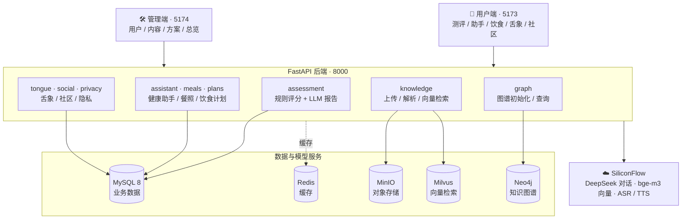
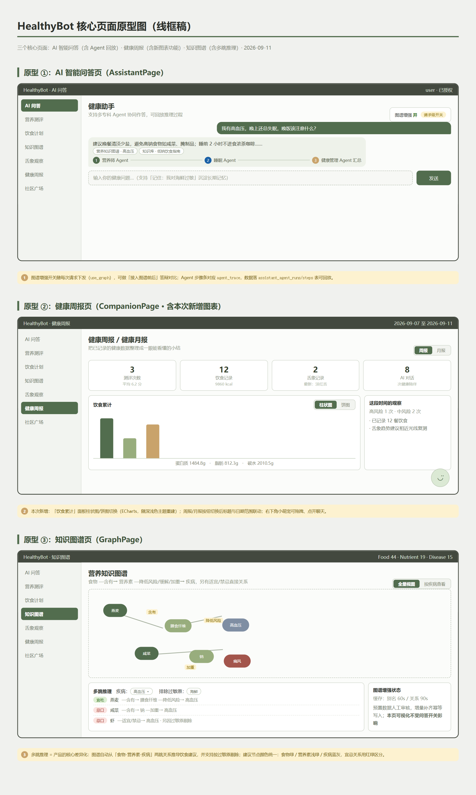
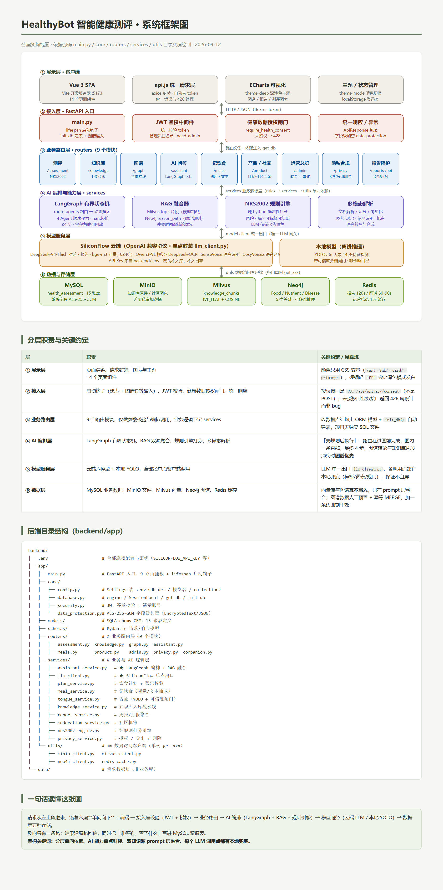
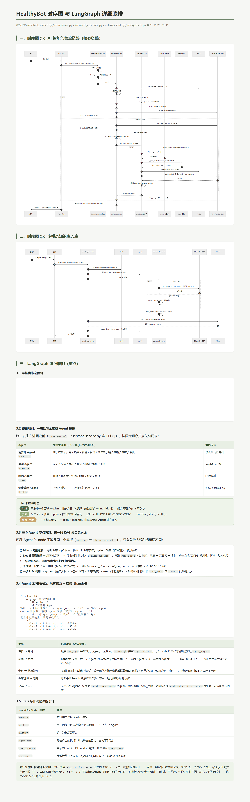
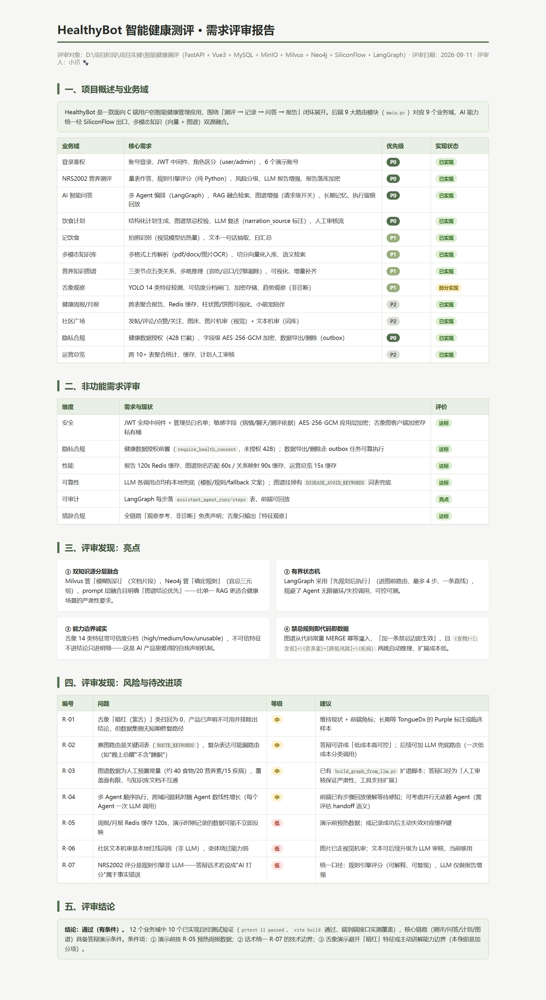

<div align="center">

# 🥗 HealthyBot · AI 智能健康测评系统

**多模态知识库 → 营养风险测评 → AI 健康洞察 → 数据可视化** 的全闭环健康管理系统

以 **NRS2002 营养风险筛查** 为核心，融合 RAG 知识库、营养知识图谱、多模态（文本 / 图像 / 语音）输入与智能问答


</div>

---

## 📖 项目简介

本系统面向「营养风险筛查 — 健康干预 — 效果追踪」的完整业务链路，解决三个实际问题：

| 问题 | 本系统的答案 |
|---|---|
| 营养风险评估依赖人工、口径不一 | 内置 **NRS2002 规则引擎**，四维评分自动出结论，结果可复现 |
| 健康知识分散、检索靠关键词 | **多模态知识库**（文档 / 图片）+ bge-m3 向量语义检索，支持 OCR 入库 |
| 报告缺乏解释性、看不到关联 | **营养知识图谱**（食物-营养素-疾病）+ LLM 生成测评解读报告 |

在测评与知识库之上，系统还扩展了 **AI 健康助手、饮食计划、舌象观察、社区广场、隐私与合规** 等产品能力，形成一个可演示、可答辩、可继续演进的完整应用。

---

## ✨ 核心功能

| 模块 | 说明 |
|---|---|
| 🩺 **营养风险测评** | NRS2002 四维评分（营养受损 / 疾病严重度 / 年龄），0-7 分四档风险，自动生成 LLM 解读报告与干预建议 |
| 📊 **可视化总览** | 风险分布环形图、评分趋势、维度雷达，基于 ECharts 的统计看板 |
| 📚 **多模态知识库** | 上传 PDF / Word / Markdown / 图片 → 解析 → 向量化入库 → 语义检索；支持 OCR 提取图片文字 |
| 🕸 **营养知识图谱** | Neo4j 承载 `Food / Nutrient / Disease` 三类实体，支持图谱可视化、疾病关联查询、测评联动提示 |
| 🤖 **AI 健康助手** | 多轮对话，按「营养 / 运动 / 睡眠 / 健康管理」自动路由；结合用户健康画像给出个性化建议 |
| 🍱 **餐照识别与饮食记录** | 上传餐照做视觉识别 → 用户确认 → 保存；汇总每日热量与三大营养素 |
| 🥗 **一周饮食计划** | 按人群与目标生成菜单与购物清单 |
| 👅 **舌象观察** | YOLOv8 定位舌体 + 苔质分类，输出检测框、置信度与**非诊断性**颜色/苔质观察及趋势 |
| 🗣 **语音交互** | ASR 语音转写 / TTS 语音播报，模型不可用时返回可确认的降级结果 |
| 💬 **社区广场** | 动态发布、点赞、评论、关注，含内容机审 |
| 🔐 **隐私与合规** | 知情同意管理、AES-256-GCM 文本加密、长期记忆管理、数据导出与删除 |
| 🛠 **管理端** | 独立端口的管理后台：用户、内容、方案与运营总览 |

> 所有助手回复与健康建议均带有 **「仅供健康观察与生活方式参考，不能替代医生诊断」** 的提示语。

---

## 🏗 系统架构



---

## 🖼 界面与设计原型

> 以下为项目配套的**设计原型 / 架构文档**（线框稿，`.html` 源文件已随仓库提供），完整呈现了各功能页的信息结构与交互流程。

### 核心页面原型图

<a href="docs/screenshots/ui-prototype.png"></a>

### 系统框架图

<a href="docs/screenshots/system-architecture.png"></a>

### 时序图 与 LangGraph 详细联排

<a href="docs/screenshots/sequence-langgraph.png"></a>

### 需求评审报告

<a href="docs/screenshots/requirements-review.png"></a>

---

## 🧰 技术栈

| 层次 | 技术选型 |
|---|---|
| 前端 | Vue 3（`<script setup>` SFC）· Vite 8 · ECharts 6 · Axios · 原生 CSS 主题体系 |
| 后端 | FastAPI · Uvicorn · Pydantic v2 · SQLAlchemy · JWT 鉴权 |
| 数据存储 | MySQL 8（业务）· Redis（缓存）· MinIO（对象存储） |
| 检索与图谱 | Milvus（bge-m3 向量）· Neo4j（营养知识图谱） |
| 大模型 | SiliconFlow：对话生成 · 文本向量 · OCR · ASR / TTS |
| 视觉模型 | YOLOv8（舌体检测）+ 苔质分类模型 |
| 工程化 | Jenkins（`Jenkinsfile`）· pytest 用例 · 演示数据脚本 |

---

## 📂 目录结构

```
AI-/
├── HealthyBot_原型图.html                  # 核心页面线框原型
├── HealthyBot_系统框架图.html               # 系统框架图
├── HealthyBot_时序图与LangGraph联排.html    # 时序图 + LangGraph 联排详解
├── HealthyBot_需求评审.html                # 需求评审报告
├── Jenkinsfile                             # CI/CD 流水线
├── docs/
│   └── screenshots/                        # README 展示用截图
└── 智能健康测评/
    ├── README.md                           # 子系统详细说明
    ├── PyCharm启动说明.md
    ├── start.bat                           # 一键启动脚本
    ├── backend/
    │   ├── app/
    │   │   ├── main.py                     # FastAPI 入口
    │   │   ├── core/                       # 配置 / 数据库 / 安全 / 数据保护
    │   │   ├── models/                     # SQLAlchemy 模型（测评/助手/鉴权/知识/饮食/计划/隐私/社区/舌象）
    │   │   ├── schemas/                    # Pydantic 数据契约
    │   │   ├── routers/                    # assessment / knowledge / graph / assistant / meals / privacy / admin ...
    │   │   ├── services/                   # NRS2002 引擎 / LLM 客户端 / 报告 / 知识库 / 舌象 ...
    │   │   └── utils/                      # MinIO / Milvus / Neo4j / Redis 客户端
    │   ├── models/tongue/                  # 舌象 YOLO 与分类模型权重
    │   ├── scripts/                        # 演示数据、数据集准备、训练与迁移脚本
    │   ├── sql/init.sql                    # 建库建表 + 示例数据 + 视图
    │   ├── tests/                          # 验收与领域契约测试
    │   └── requirements.txt
    ├── frontend/
    │   ├── src/
    │   │   ├── api.js                      # 接口封装
    │   │   ├── App.vue                     # 应用外壳与导航
    │   │   ├── views/                      # 13 个功能页
    │   │   └── assets/                     # 食物 / 场景图资源
    │   └── package.json
    └── docs/                               # 专项技术文档
```

---

## 🚀 快速开始

### 环境依赖

| 服务 | 默认地址 | 用途 |
|---|---|---|
| MySQL 8 | `127.0.0.1:3306` | 测评记录、知识库元数据 |
| Redis | `127.0.0.1:6379` | 缓存 |
| MinIO | `127.0.0.1:9000` | 知识文件对象存储 |
| Milvus | `127.0.0.1:19530` | 文本块向量检索 |
| Neo4j | `bolt://127.0.0.1:7687` | 营养知识图谱 |
| SiliconFlow | API Key | LLM 报告 / 向量 / OCR / 语音 |

### 1. 启动后端（8000）

```bash
cd 智能健康测评/backend
python -m venv venv                       # 首次
venv/Scripts/pip install -r requirements.txt
venv/Scripts/python -m uvicorn app.main:app --reload --port 8000
```

首次运行可执行 `sql/init.sql` 完成建表与示例数据导入。

### 2. 启动前端

```bash
cd 智能健康测评/frontend
npm install
npm run dev:user     # 用户端 → http://127.0.0.1:5173
npm run dev:admin    # 管理端 → http://127.0.0.1:5174
```

> 演示账号（默认，请在生产环境务必修改）：用户端 `user / user123`，管理端 `admin / admin123`。

### 3. 配置模型密钥

复制 `backend/.env.example` 为 `.env`，填写 `SILICONFLOW_API_KEY` 等配置。
**请勿将真实密钥提交到版本库。**

- 接口文档（Swagger）：http://127.0.0.1:8000/docs
- 后端启动说明：详见 [`智能健康测评/PyCharm启动说明.md`](智能健康测评/PyCharm启动说明.md)

---

## 🎬 演示路线（推荐顺序）

1. **登录页** → 选择用户端，登录进入工作台
2. **营养风险测评** → 一键载入高风险示例 → 查看 NRS2002 四维评分依据 + AI 解读报告 + 图谱命中提示
3. **可视化总览** → 风险分布环形图 / 评分趋势 / 维度雷达
4. **多模态知识库** → 上传知识文档或图片 → 语义检索提问
5. **营养知识图谱** → 点击疾病（如 2 型糖尿病）查看关联营养素与食物
6. **AI 健康助手** → 多轮健康对话，观察问题路由与画像结合
7. **餐照识别 / 饮食计划** → 上传餐照识别热量，生成一周菜单

---

## 📐 NRS2002 评分规则

总分 0-7 分，**≥ 3 分判定为高风险，需启动营养支持**。

| 维度 | 判定规则 | 分值 |
|---|---|---|
| **营养受损** | BMI < 18.5 | 3 |
| | BMI 18.5~20.5 / 近 3 月体重下降 > 5% / 进食量减少 25%~50% | 1 |
| | 近 3 月体重下降 > 10% / 进食量减少 50%~75% | 2 |
| **疾病严重度** | 无 | 0 |
| | 轻度（稳定期慢性病） | 1 |
| | 中度（卧床 / 大手术 / 肺炎 / 肿瘤放化疗） | 2 |
| | 重度（ICU / 重症） | 3 |
| **年龄** | ≥ 70 岁 | 1 |

**风险分档**：0 无风险 · 1 低风险 · 2 中风险 · ≥3 高风险

---

## 📑 文档索引

| 文档 | 内容 |
|---|---|
| [`智能健康测评/README.md`](智能健康测评/README.md) | 子系统完整说明：接口速查、启动细节、扩展能力 |
| [`智能健康测评/PyCharm启动说明.md`](智能健康测评/PyCharm启动说明.md) | PyCharm 环境配置与调试启动 |
| [`智能健康测评/docs/`](智能健康测评/docs/) | 知识图谱优化报告、舌象 YOLO 技术分析与训练手册、功能测试用例等 |
| `HealthyBot_原型图.html` | 核心页面线框原型（clone 后用浏览器打开） |
| `HealthyBot_系统框架图.html` | 系统框架图 |
| `HealthyBot_时序图与LangGraph联排.html` | 业务时序图与 LangGraph 编排详解 |
| `HealthyBot_需求评审.html` | 需求评审报告 |

---

## ⚠️ 免责声明

- 本项目为**技术演示与教学实践**用途，所有测评结果、健康建议、舌象观察**仅供健康观察与生活方式参考，不构成医疗诊断或治疗建议**。
- 如有健康问题，请及时咨询执业医师或注册营养师。
- 涉及个人健康数据的部署，请务必配置独立的 `HEALTH_DATA_ENCRYPTION_KEY` 与密钥管理服务，并遵守所在地的数据保护法规。

---

<div align="center">

**欢迎各位大神和高手交流指导** 🙌

如果这个项目对你有帮助，欢迎 Star ⭐ 与交流讨论

</div>
